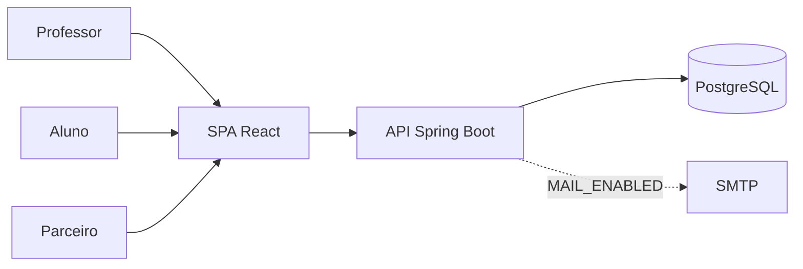
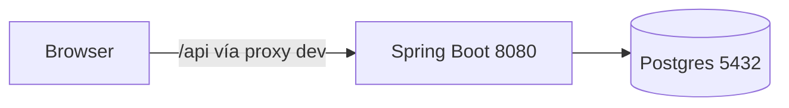

# Sistema de Moeda Estudantil

**Monorepo** de **API REST (Spring Boot)** + **SPA (React, Vite, TypeScript)** com **PostgreSQL**: moedas virtuais emitidas por professores, resgate de vantagens por alunos e cadastro/gestão por parceiros. Autenticação **JWT** (stateless) e e-mail opcional via **JavaMail**. Projeto de **laboratório de software** com histórias e diagramas em `docs/uml/`.

<div align="center">

[](https://openjdk.org/)
[](https://spring.io/projects/spring-boot)
[](https://react.dev/)
[](https://www.postgresql.org/)
[](https://vitejs.dev/)
[](https://www.typescriptlang.org/)
[](#-autores-e-licença)

[Funcionalidades](#-funcionalidades) · [Tecnologias](#-tecnologias) · [Dependências (Maven)](#-dependências-maven) · [Estrutura](#-estrutura-do-repositório) · [Como o backend funciona](#-como-o-backend-funciona) · [API](#-endpoints-da-api) · [Como rodar](#-como-rodar-o-projeto)

</div>

---

> **TL;DR** | **O quê:** fidelidade acadêmica com saldo, extrato e vantagens. | **Quem:** professores, alunos, parceiros (RBAC). | **Dados:** PostgreSQL; crédito semestral e chave de semestre em `America/Sao_Paulo`. | **Lógica de negócio** só no servidor.

---

## Conteúdo

1. [Visão e domínio](#-visão-de-produto-e-domínio)
2. [Funcionalidades](#-funcionalidades)
3. [Arquitetura (resumo)](#-arquitetura-resumo)
4. [Tecnologias](#-tecnologias)
5. [Dependências (Maven)](#-dependências-maven)
6. [Estrutura do repositório](#-estrutura-do-repositório)
7. [Como o backend funciona](#-como-o-backend-funciona)
8. [Endpoints da API](#-endpoints-da-api)
9. [Como rodar o projeto](#-como-rodar-o-projeto)
10. [Variáveis de ambiente](#-variáveis-de-ambiente)
11. [Segurança e autenticação](#-segurança-e-autenticação)
12. [Produção e cuidados](#-produção-e-cuidados)
13. [Documentação UML e Git](#-documentação-uml)
14. [Links úteis](#-links-úteis)
15. [Autores e licença](#-autores-e-licença)

---

## Visão de produto e domínio

- **Regra central:** a cada **novo semestre lógico**, o professor recebe **+1.000 moedas** (atualização de saldo ao consultar enviar, conforme `TransacaoFachada` e [`SemestreUtil`](backend/src/main/java/com/moedaestudantil/application/SemestreUtil.java)).
- **Semestre** no código: chave `AAAA-S` (ex.: `2026-1` jan–jun, `2026-2` jul–dez) no fuso `America/Sao_Paulo`.
- **Envio de moedas:** apenas para **aluno da mesma instituição**; **justificativa obrigatória**; validação de saldo.
- **Resgate:** aluno consome vantagem de parceiro; sistema registra trânsito e identificador de resgate; e-mail se `MAIL_ENABLED=true` e SMTP válido.

**Glossário**

| Termo | Descrição |
|-------|------------|
| Moeda | Unidade inteira de crédito (`long`). |
| Extrato | Listagem conforme o **papel** do token (aluno x professor). |
| Vantagem / resgate | Oferta de parceiro; débito do aluno e rastreabilidade. |

A SPA chama somente a API; regras críticas **não** dependem de validação exclusiva do browser.

---

## Funcionalidades

- **Registro e login** – Cadastro por perfil, instituição, JWT no client (`accessToken`).
- **Crédito semestral (professor)** – Garantia automática de **1.000 moedas** por semestre ao trocar a chave; saldo e extrato.
- **Envio de moedas** – Professor seleciona aluno da mesma instituição, quantidade e justificativa; notificação opcional ao aluno.
- **Catálogo de vantagens** – Listagem (páginas Spring); parceiros mantêm ofertas conforme controladores de parceiro.
- **Resgate (aluno)** – Débito e registro de resgate (cupom); regras no backend.
- **E-mail (opcional)** – *Feature flag* `MAIL_ENABLED`; desligado no dev sem SMTP.
- **Interface SPA** – React + Vite, rotas, fachadas TypeScript em `frontend/src/api` (fetch + `Authorization`).

*Sugestão de README:* adicione em `docs/` capturas da home, login, extrato e tela de envio — o repositório ainda não versiona *screenshots* (opcional, como no projeto de referência).

---

## Arquitetura (resumo)

### Atores e sistema



### Contêineres



### Camadas (`com.moedaestudantil`)

| Camada | Papel |
|--------|--------|
| `domain` | Modelo, portas (interfaces). |
| `application` | Fachadas, fábricas, regras de transação, notificação. |
| `infrastructure` | JPA, JWT, e-mail, seed. |
| `web` | REST, DTOs, `@PreAuthorize`, erros 422. |

**Front** – *features* em `frontend/src/features`, proxy Vite: `/api` → `http://localhost:8080` ([`vite.config.ts`](frontend/vite.config.ts)).

| Decisão | Motivo breve |
|---------|----------------|
| JWT stateless | Escalabilidade horizontal sem *sticky session*. |
| JPA + PostgreSQL | Consistência transacional para saldo e extrato. |
| DTOs na borda | Contrato HTTP estável, domínio isolado. |

---

## Tecnologias

| Tecnologia | Uso |
|------------|-----|
| **Java 17** | Linguagem do backend. |
| **Spring Boot 3.2.5** | Web, JPA, Security, Validation, Mail. |
| **Spring Security + jjwt 0.12.5** | Autenticação e parsing JWT. |
| **PostgreSQL** | Persistência (dev: Docker Compose 16). |
| **Lombok** | `domain` e redução de *boilerplate* (imutáveis, etc.). |
| **React 18 + TypeScript + Vite 5** | SPA e build. |
| **Tailwind CSS 3** | Estilos. |
| **React Router 6** | Navegação. |
| **Maven** | Build do backend. |
| **npm** | Build do *front*. |

---

## Dependências (Maven)

Versões de starters gerenciadas pelo **POM parent** `spring-boot-starter-parent:3.2.5` ([`backend/pom.xml`](backend/pom.xml)).

| Grupo | Artefato | Descrição |
|-------|----------|------------|
| `org.springframework.boot` | `spring-boot-starter-web` | Controllers REST, JSON. |
| `org.springframework.boot` | `spring-boot-starter-data-jpa` | JPA, Hibernate, repositórios. |
| `org.springframework.boot` | `spring-boot-starter-security` | Filtros, `@PreAuthorize`. |
| `org.springframework.boot` | `spring-boot-starter-validation` | Bean Validation (`@Valid`, etc.). |
| `org.springframework.boot` | `spring-boot-starter-mail` | E-mail (SMTP). |
| `org.postgresql` | `postgresql` | Driver JDBC. |
| `io.jsonwebtoken` | `jjwt-api` / `jjwt-impl` / `jjwt-jackson` | **0.12.5** – JWT. |
| `org.projectlombok` | `lombok` | Anotações. |
| `org.springframework.boot` | `spring-boot-starter-test` | Testes (escopo *test*). |

---

## Estrutura do repositório

```text
sistema-moeda-estudantil/
├── backend/
│   ├── pom.xml
│   ├── .env.example
│   └── src/main/java/com/moedaestudantil/
│       ├── MoedaEstudantilApplication.java
│       ├── domain/           # modelos, portas
│       ├── application/      # fachadas, SemestreUtil, fabricas, estratégias
│       ├── infrastructure/   # JPA, segurança JWT, mail, seed
│       └── web/              # REST, DTOs, handlers
│   └── src/main/resources/
│       └── application.yaml
├── frontend/
│   ├── package.json
│   ├── vite.config.ts
│   └── src/                  # app, features, api, assets
├── docs/uml/                 # histórias, PlantUML, índice
└── docker-compose.yml        # Postgres 16 (desenvolvimento)
```

---

## Como o backend funciona

O fluxo central de **envio de moedas** está em [`TransacaoFachada`](backend/src/main/java/com/moedaestudantil/application/facade/TransacaoFachada.java):

1. **Garantir crédito de semestre** – Lê a chave atual (`SemestreUtil.chaveSemestre()`); se mudou em relação à última distribuição, **soma 1.000** ao saldo e atualiza a chave.
2. **Validar ligação professor–aluno** – `instituicaoId` deve coincidir; caso contrário, `RegraDeNegocio` (erro 422 no handler).
3. **Criar lote de envio** – `TransacaoFabrica` com quantidade e justificativa; checagem de saldo suficiente.
4. **Atualizar saldos** – Débito no professor, crédito no aluno (transação).
5. **Auditoria e notificação** – Registro de transação + *strategy* de notificação se e-mail ativo.

**Resgate e parceiro** – Controladores no pacote `web` (ex.: [`ControleVantagensResgate`](backend/src/main/java/com/moedaestudantil/web/ControleVantagensResgate.java)) aplicam o mesmo padrão: regra na aplicação, persistência em portas, autorização por perfil.

---

## Endpoints da API

**Base path:** `http://localhost:8080/api/v1` (ou sua URL de deploy + `/api/v1`).

| Método | Rota | Acesso | Descrição |
|--------|------|--------|------------|
| `GET` | `/instituicoes` | Público | Lista de instituições. |
| `POST` | `/auth/registrar` | Público | Cadastro. |
| `POST` | `/auth/entrar` | Público | Retorna `accessToken`. |
| `GET` | `/auth/eu` | Autenticado | Usuário corrente. |
| `GET` | `/professores/meu-saldo` | `PROFESSOR` | Saldo (inclui lógica de semestre). |
| `POST` | `/professores/enviar-moedas` | `PROFESSOR` | JSON: `alunoId`, `quantidade`, `mensagemJustificativa`. |
| `GET` | `/alunos-na-mesma-institucao` | `PROFESSOR` | Paginação Spring. |
| `GET` | `/transacoes/extrato` | `ALUNO` ou `PROFESSOR` | Extrato conforme o papel. |
| `GET` | `/vantagens` | Público | Catálogo paginado. |
| *várias* | rotas `parceiro/…` | `PARCEIRO` | Vantagens — ver `ControleVantagensResgate`. |
| `POST` | `/alunos/resgatar-vantagem/{id}` | `ALUNO` | Resgate. |

**Erros:** muitas violações de regra retornam **422** com `{ "erro": "…" }`; token inválido / ausente → **401**.

### Exemplos (cURL)

*Instituições (público):*

```bash
curl -s http://localhost:8080/api/v1/instituicoes
```

*Login (obtenha o token do JSON de resposta):*

```bash
curl -s -X POST http://localhost:8080/api/v1/auth/entrar \
  -H "Content-Type: application/json" \
  -d "{\"email\":\"professor@exemplo.com\",\"senha\":\"sua-senha\"}"
```

*Chamada autenticada (substitua `SEU_JWT`):*

```bash
curl -s http://localhost:8080/api/v1/auth/eu \
  -H "Authorization: Bearer SEU_JWT"
```

---

## Como rodar o projeto

### Pré-requisitos

- **Java 17+**
- **Maven 3.8+** (ou IDE com import do `pom.xml`)
- **Node.js 18+** (LTS) e **npm**
- **Docker** (opcional, para subir o Postgres de dev) **ou** PostgreSQL 14+ local

### Passos (ordem: banco → API → *front*)

1. **Banco**

   ```bash
   docker compose up -d
   ```

   Credenciais padrão do [docker-compose.yml](docker-compose.yml): `moeda` / `moeda`, database `moeda`, porta **5432**.

2. **API** (pasta `backend/`)

   ```bash
   mvn spring-boot:run
   ```

3. **Front** (pasta `frontend/`)

   ```bash
   npm install
   npm run dev
   ```

4. **Acesse** a SPA: **http://localhost:5173** (em dev, proxy envia `/api` para a API na **8080**).

### Build para deploy

**API (JAR):**

```bash
cd backend
mvn clean package -DskipTests
java -jar target/backend-0.0.1-SNAPSHOT.jar
```

**Front (estáticos em `dist/`):**

```bash
cd frontend
npm run build
```

Se a API estiver em **outro host/origem**, defina `VITE_API_BASE` **no build** (variável do Vite).

> Este repositório fornece **`docker-compose` só para o PostgreSQL**, não um `Dockerfile` *full-stack* como em projetos *single JAR* + *Render*. Para cloud, o padrão é: API (JAR ou imagem) + banco gerenciado + *front* em *object storage* ou *CDN*, ou um *platform PaaS* com variáveis listadas abaixo.

---

## Variáveis de ambiente

Fonte: [`application.yaml`](backend/src/main/resources/application.yaml) e [`.env.example`](backend/.env.example).

| Variável | Onde | Descrição |
|----------|------|-----------|
| `DATABASE_URL` | API | JDBC, ex. `jdbc:postgresql://localhost:5432/moeda` |
| `DATABASE_USER` / `DATABASE_PASSWORD` | API | Acesso ao Postgres |
| `JWT_SECRET` | API | HMAC; **troque** em produção |
| `JWT_EXPIRATION_MIN` / `app.jwt.expiration-minutes` | API | Validade (min) |
| `API_BASE_URL` | API | Base pública, default `http://localhost:8080` |
| `PORT` | API | Porta do servlet (padrão **8080**; muitas plataformas injetam `PORT`) |
| `MAIL_ENABLED` | API | `true` liga e-mail |
| `MAIL_HOST`, `MAIL_PORT`, `MAIL_USERNAME`, `MAIL_PASSWORD` | API | SMTP |
| `VITE_API_BASE` | *Build* do front | URL base da API em produção (cross-origin) |

O Spring **não** lê `.env` automaticamente; use shell, IDE ou o provedor de *deploy*.

---

## Segurança e autenticação

- **Header:** `Authorization: Bearer <accessToken>`.
- **Papéis Spring:** `ALUNO`, `PROFESSOR`, `PARCEIRO` (`@PreAuthorize`).
- **CORS / produção:** com *front* e *API* em origens distintas, configure origens permitidas no backend e alinhe `VITE_API_BASE` (não use `*` com credenciais reais em produção).

---

## Produção e cuidados

- Rotação e segredo forte para **`JWT_SECRET`**.
- **`ddl-auto: update`** — adequado ao lab; em produção, use **migrações** (Flyway/Liquibase).
- Escalar a API = mais instâncias *stateless* + Postgres dimensionado; reutilizar o mesmo padrão de *pool* de conexões.
- **Testes:** o POM inclui `spring-boot-starter-test`; evoluir com `src/test` para fluxos de saldo e resgate.

---

## Documentação UML

- [Histórias de usuário](docs/uml/historias_de_usuario.md)
- [Índice PlantUML e exportação](docs/uml/README.md) — casos de uso, domínio, componentes, sequência.

### Git: commits e sprints

- Formato: `tipo(escopo): descrição [SprintNN][USmm]`
- Ex.: `feat(auth): registro aluno [Sprint01][US01]`
- [Conventional Commits](https://www.conventionalcommits.org/)

---

## Links úteis

| Recurso | URL |
|---------|-----|
| Spring Boot | https://spring.io/projects/spring-boot |
| Spring Security | https://spring.io/projects/spring-security |
| jjwt | https://github.com/jwtk/jjwt |
| PostgreSQL | https://www.postgresql.org/ |
| Vite | https://vitejs.dev/ |
| React | https://react.dev/ |
| Conventional Commits | https://www.conventionalcommits.org/ |

---

## Autores e licença

**Alunos (equipe de desenvolvimento):**

- **Lara Andrade**
- **Allan Mateus**
- **Gabriel Peçanha**

*Turma e repositório oficial da disciplina:* preencha aqui se o curso exigir identificação adicional.

**Licença:** a definir no repositório (sugestão: **MIT** ou exigência institucional).

---

<div align="center">
  <sub>README no estilo de documentação rica (funcionalidades, tabelas, dependências, fluxo do serviço, cURL) — alinhado ao padrão do projeto de referência <strong>PdfTranslator</strong>, com conteúdo específico deste monorepo.</sub>
</div>
